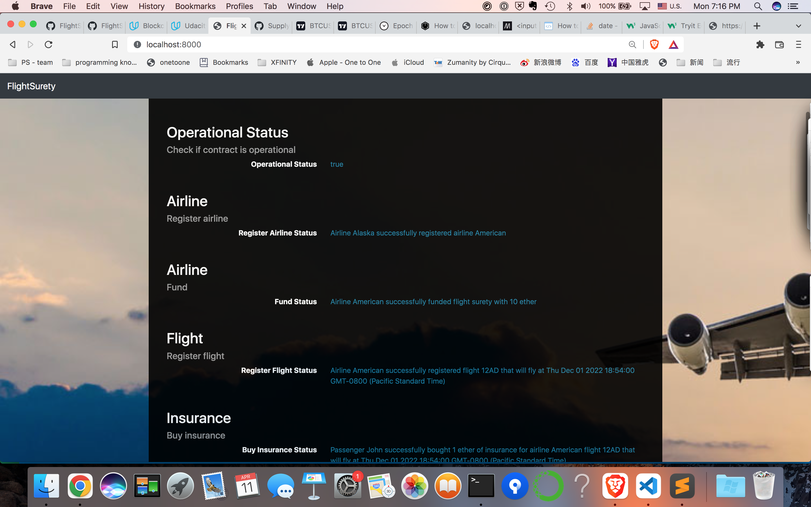
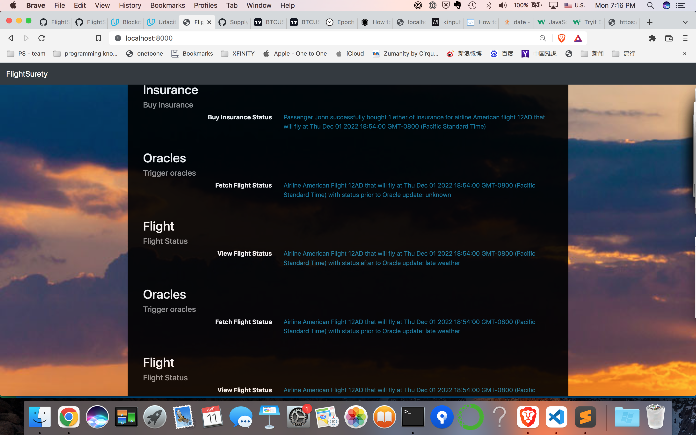
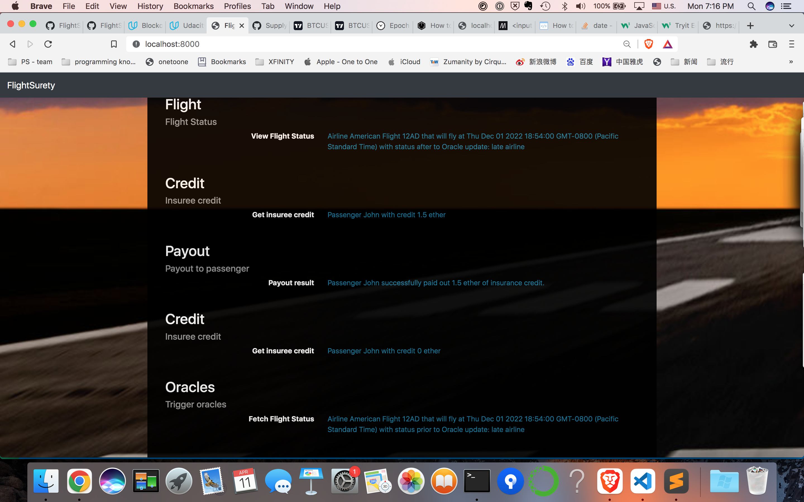
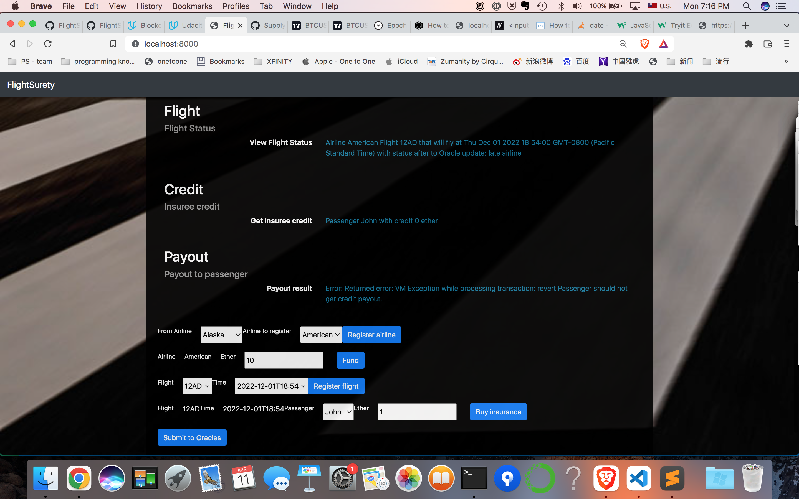
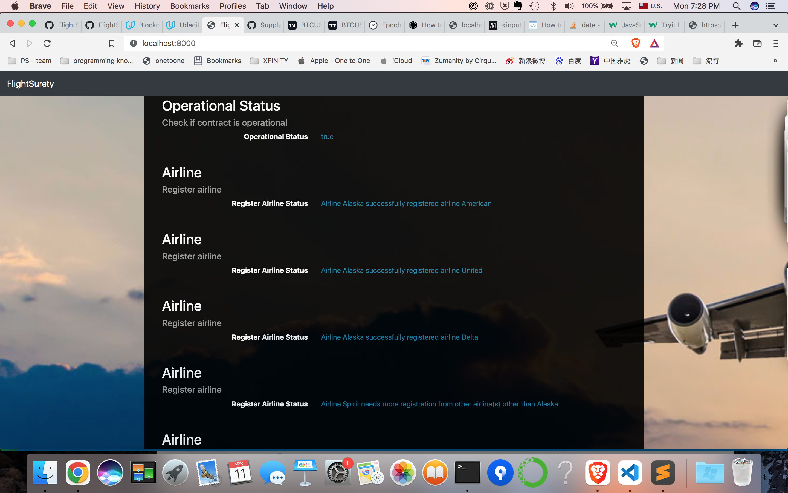
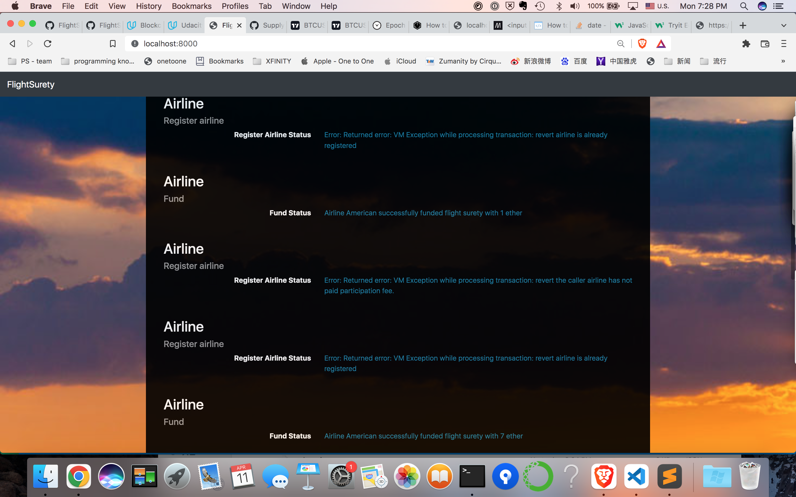
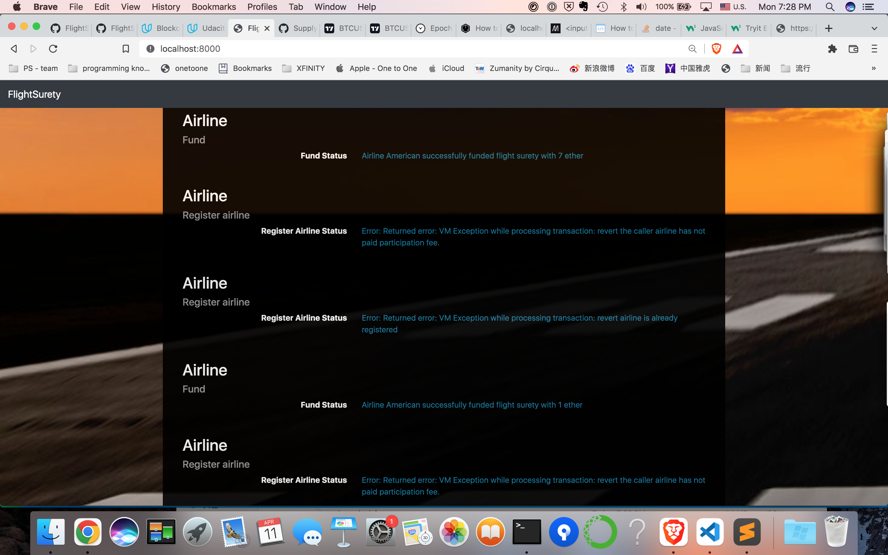
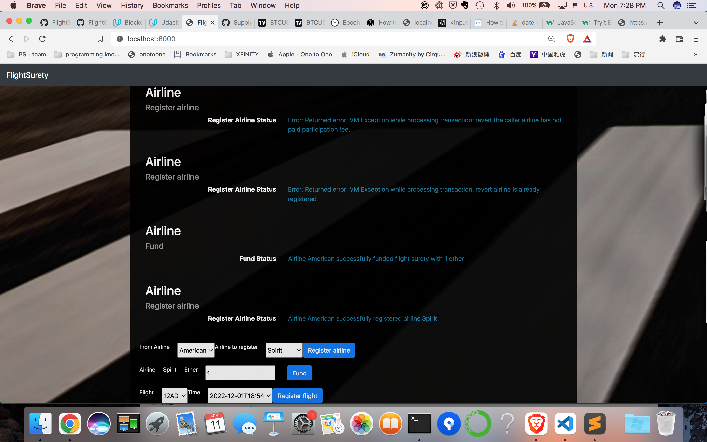

# FlightSurety

This is a completed FlightSurety project, as part of the Udacity assignment.

## Install

This repository contains Smart Contract code in Solidity (using Truffle), tests (also using Truffle), dApp scaffolding (using HTML, CSS and JS) and server app scaffolding.

To install, download or clone the repo, then:

`./bootstrap.sh`

The bootstrap script encapsulates the startup of local ganache, contract migration, dapp as well as server, so that the developer doesn't have to open up multiple terminals to spawn them. They are run in the background.

The bootstrap script is re-entrant, and safe to re-run, since it will kill the local ganache, dapp, as well as oracle-emulated server processes before spawning them again.

## Dapps screenshots demo

### Single airline flight with single passenger insurance payout flow

The first airline is Alaska, which gets registered during the contract deploy time. During the DApp startup time, the DApp also makes the Alaska fund the flight surety, so that Alaska can now register another airline. Then the American airline gets registered, and it funds another 10 ETH to the flight surety. After that, we choose flight 12AD with time 2022-12-01T18:54 to register the flight. Then the passenger John wants to purchase the insurance for the maximum amount, 1 ETH. Once submitted to Oracles, We keep viewing flight status until it is the late airline. Then we can see passenger John has 1.5 ETH credit payout due to airline late. Not until when we hit withdraw payout for passenger John, the credit still remains within the flight surety. By withdrawing, now the 1.5 ETH credit transferred to John's wallet. As a final check, we need to ensure that John doesn't have a way to exploit flight surety. We try to submit the same flight to the Oracles again to trigger airline late. However this time, John does not have any credit payout, since he already get paid out previously. No one can register the same flight again, since it's already registered.









### Multi-party consensus flow

The first airline Alask can register American, United, and Delta freely. But with Spirit, it needs one more vote from another airline. We will fund America airline, so that it can register Spirit. We also demonstrat that even though American airline gets registered, it cannot vote Spirit yet, until American airline funds 10 ETH cumulatively to flight surety.









# Dependencies

```
JanettekiMacBook-Pro:FlightSurety janet$ truffle version
Truffle v5.4.22 (core: 5.4.22)
Solidity - ^0.4.24 (solc-js)
Node v16.13.1
Web3.js v1.5.3
JanettekiMacBook-Pro:FlightSurety janet$ node -v
v16.13.1
JanettekiMacBook-Pro:FlightSurety janet$ npm list web3 | grep web3
└── web3@1.5.3
```